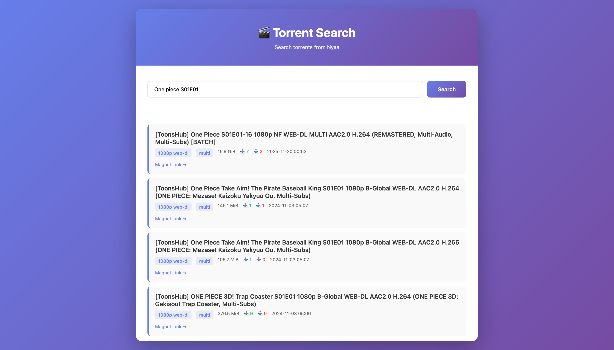

# Torrent Search Go

A simple Go application that searches torrents from Nyaa and exposes the results through both a CLI and a web interface.

## Features

- Search torrents from the command line
- Run a web server with a browser UI
- JSON API for search and health checks
- Clean static frontend served by the Go backend

## Requirements

- Go 1.26 or newer

## Setup

1. Clone the repository.
2. Install dependencies with Go modules:

   ```bash
   go mod download
   ```

## Run

### Web mode

Start the server on `http://localhost:8080`:

```bash
go run .
```

You can also pass `serve` explicitly:

```bash
go run . serve
```

### CLI mode

Search directly from the terminal:

```bash
go run . "your search query"
```

## API

- `GET /api/search?q=<query>` - search torrents
- `GET /api/health` - health check

## Screenshots

### Web UI



## Project Structure

```text
configs/    Configuration loading and scraper config files
core/       Core search logic
models/     Shared data models
scrapers/   Scraper implementations
web/        HTTP handlers and static frontend
```

## Notes

- The app serves static files from `web/static`.
- The default scraper is configured in `configs/scrapers.json`.